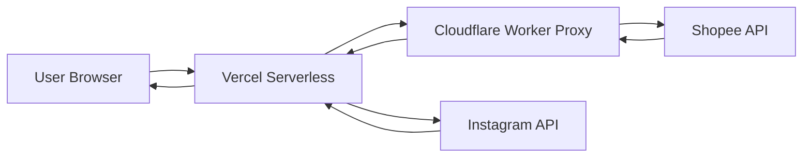

<div align="center">

# 🛍️ Model Manis E-Commerce Platform

### Real-Time Product Showcase with Stateless Architecture

[](https://www.djangoproject.com/)
[](https://www.python.org/)
[](https://vercel.com)
[](LICENSE)

[Live Demo](https://your-deployment.vercel.app) • [Documentation](#documentation) • [Report Issue](https://github.com/AldyLoing/Web-Toko-Model-Manis/issues)

</div>

---

## � Overview

**Model Manis** is a modern, stateless e-commerce showcase platform that synchronizes real-time product data from Shopee and Instagram without requiring a traditional database. Built for fashion retailers who want a fast, maintenance-free online presence that automatically reflects their latest inventory.

### The Problem

Traditional e-commerce platforms require:
- Manual product updates across multiple channels
- Complex database management and maintenance
- Server infrastructure for hosting
- Constant synchronization between store and website
- High operational overhead for small businesses

### The Solution

Model Manis eliminates these pain points through:
- **Zero-Database Architecture** - Fully stateless, API-first design
- **Real-Time Sync** - Products automatically updated from Shopee
- **Serverless Deployment** - Deploy globally in minutes
- **Social Integration** - Instagram feed embedded automatically
- **Smart Proxy** - Cloudflare Worker bypasses API restrictions

### How It Works



1. **User visits website** → Request sent to Vercel serverless function
2. **Django fetches data** → Via Cloudflare Worker to avoid rate limits
3. **Shopee/Instagram APIs** → Return real-time product and social data
4. **Response cached** → 5-minute intelligent caching for performance
5. **Page rendered** → Fast, SEO-friendly HTML served to user

---

## ✨ Key Features

### 🎯 Core Capabilities

| Feature | Description | Status |
|---------|-------------|--------|
| **Real-Time Products** | Auto-sync from Shopee store | ✅ Active |
| **Instagram Gallery** | Embedded social feed | ✅ Active |
| **Zero Database** | Stateless serverless architecture | ✅ Active |
| **Smart Caching** | 5-minute intelligent cache | ✅ Active |
| **Cloudflare Proxy** | Bypass API restrictions | ✅ Active |
| **Responsive Design** | Mobile-first Bootstrap 5 | ✅ Active |
| **SEO Optimized** | Server-side rendering | ✅ Active |
| **Graceful Fallback** | Placeholder content on API failure | ✅ Active |

### 🔧 Technical Highlights

- **API-First Architecture** - No database, all data from external APIs
- **Serverless Ready** - Deploy to Vercel, Netlify, or any serverless platform
- **Smart Proxy Layer** - Cloudflare Worker handles Shopee rate limiting
- **Automatic Caching** - Django's LocMemCache for optimal performance
- **Static Asset Optimization** - WhiteNoise for efficient file serving
- **Environment-Based Config** - Easy setup with environment variables

---

## 🏗️ Technology Stack

### Backend
- **Django 5.1.6** - Modern Python web framework
- **WhiteNoise** - Static file serving
- **Python 3.10+** - Latest Python features

### External APIs
- **Shopee API v4** - Product catalog integration
- **Instagram Basic Display API** - Social media content
- **Cloudflare Workers** - Edge computing proxy

### Frontend
- **Bootstrap 5** - Responsive UI framework
- **HTML5/CSS3** - Modern web standards
- **JavaScript** - Interactive components

### Infrastructure
- **Vercel** - Serverless deployment platform
- **Cloudflare** - CDN and edge computing
- **Django LocMemCache** - In-memory caching

---

## 🚀 Installation & Setup

### Prerequisites

- Python 3.10 or higher
- pip (Python package manager)
- Git
- Cloudflare account (free tier)
- Shopee store (for product data)
- Instagram Business account (optional)

### Local Development

#### 1. Clone Repository

```bash
git clone https://github.com/AldyLoing/Web-Toko-Model-Manis.git
cd Web-Toko-Model-Manis
```

#### 2. Create Virtual Environment

```bash
# Windows
python -m venv env
env\Scripts\activate

# Linux/Mac
python3 -m venv env
source env/bin/activate
```

#### 3. Install Dependencies

```bash
pip install -r requirements.txt
```

#### 4. Configure Environment Variables

Create a `.env` file in the project root:

```bash
# Copy example file
cp .env.example .env
```

Edit `.env` with your configuration:

```env
# Django Settings
SECRET_KEY=your-secret-key-here-generate-new-one
DEBUG=True
ALLOWED_HOSTS=localhost,127.0.0.1

# Shopee Configuration
SHOPEE_SHOP_ID=53252649
SHOPEE_PROXY=https://your-worker.workers.dev
SHOPEE_STORE_URL=https://shopee.co.id/modelmanis34

# Instagram Configuration (Optional)
INSTAGRAM_ACCESS_TOKEN=your-instagram-access-token
INSTAGRAM_PROFILE_URL=https://instagram.com/modelmanis34

# Cache Settings
API_CACHE_TIMEOUT=300
```

#### 5. Run Development Server

```bash
cd Blog
python manage.py runserver
```

Visit `http://localhost:8000` to see your site.

### Cloudflare Worker Setup

#### Why You Need This
Shopee API blocks direct requests from servers. The Cloudflare Worker acts as a browser proxy to bypass this restriction.

#### Deployment Steps

1. **Navigate to Worker Directory**
   ```bash
   cd cloudflare-worker
   ```

2. **Login to Cloudflare Dashboard**
   - Visit [dash.cloudflare.com](https://dash.cloudflare.com)
   - Go to **Workers & Pages**

3. **Create New Worker**
   - Click **Create Worker**
   - Name it: `shopee-proxy`
   - Copy content from [shopee-proxy.js](cloudflare-worker/shopee-proxy.js)
   - Paste into editor
   - Click **Deploy**

4. **Copy Worker URL**
   ```
   https://shopee-proxy.YOUR-ACCOUNT.workers.dev
   ```

5. **Add to Environment**
   - Add to `.env` file: `SHOPEE_PROXY=https://your-worker.workers.dev`
   - Or add to Vercel environment variables (see deployment section)

---

## 📦 Usage & Examples

### Fetching Products

Products are automatically fetched from Shopee when users visit the product pages. No manual intervention required.

```python
# Example: How products are fetched internally
from Blog.posting.utils.shopee_api import fetch_shopee_products

products = fetch_shopee_products(
    shop_id=53252649,
    limit=50,
    offset=0
)
```

### Instagram Integration

```python
# Example: Fetching Instagram feed
from Blog.posting.utils.instagram_api import fetch_instagram_feed

feed = fetch_instagram_feed(
    access_token='your-token',
    limit=12
)
```

### Custom Configuration

Update [settings.py](Blog/Blog/settings.py) for custom behavior:

```python
# Cache timeout (seconds)
API_CACHE_TIMEOUT = 300  # 5 minutes

# Shopee settings
SHOPEE_SHOP_ID = 'your-shop-id'
SHOPEE_STORE_URL = 'https://shopee.co.id/your-store'
```

---

## 🎯 Use Cases

### For Fashion Retailers
- Showcase products without managing inventory on website
- Automatic updates when adding products to Shopee
- Social proof through Instagram integration
- Zero maintenance overhead

### For Small Businesses
- No hosting costs with serverless deployment
- No database management required
- Easy updates through existing Shopee dashboard
- Professional online presence in minutes

### For Developers
- Learn stateless architecture patterns
- Example of API integration best practices
- Serverless deployment reference
- Modern Django patterns

---

## 🗺️ Roadmap

### Phase 1: Core Features ✅ (Completed)
- [x] Shopee API integration
- [x] Instagram feed integration
- [x] Cloudflare Worker proxy
- [x] Responsive design
- [x] Vercel deployment

### Phase 2: Enhancement 🚧 (In Progress)
- [ ] Product search functionality
- [ ] Category filtering
- [ ] Price range filters
- [ ] Product detail pages
- [ ] Shopping cart (redirect to Shopee)

### Phase 3: Advanced Features 📋 (Planned)
- [ ] Multi-language support (ID/EN)
- [ ] Dark mode toggle
- [ ] Advanced caching strategies
- [ ] Performance analytics
- [ ] SEO enhancements

### Phase 4: Scale 🚀 (Future)
- [ ] Multi-store support
- [ ] Admin dashboard
- [ ] Analytics integration
- [ ] Email notifications
- [ ] WhatsApp integration

---

## 🌍 Impact & Target Market

### Social Impact
- **Empowers Small Businesses** - Low-barrier entry to e-commerce
- **Digital Inclusion** - Enables retailers without technical expertise
- **Cost Savings** - Eliminates hosting and maintenance costs

### Environmental Impact
- **Reduced Infrastructure** - Serverless = lower energy consumption
- **Efficient Resource Use** - No idle servers or databases
- **Green Hosting** - Vercel uses renewable energy

### Economic Impact
- **Revenue Growth** - Professional online presence increases sales
- **Time Savings** - Automated sync reduces manual work
- **Accessibility** - Free tier deployment available

### Target Market

| Segment | Description | Benefits |
|---------|-------------|----------|
| **Fashion Retailers** | Small-medium online stores | Zero maintenance, auto-sync |
| **Instagram Sellers** | Social media merchants | Professional web presence |
| **Startup Founders** | New e-commerce ventures | Fast MVP deployment |
| **Developers** | Learning modern architecture | Real-world serverless example |

---

## 💡 Why This Matters

### The Traditional E-Commerce Problem
Building an online store typically requires:
- Complex inventory management systems
- Expensive hosting infrastructure
- Technical expertise for maintenance
- Constant manual updates across platforms

### Our Approach
Model Manis proves that modern e-commerce can be:
- **Simple** - No database, no backend complexity
- **Free** - Deploy on free tiers (Vercel + Cloudflare)
- **Automatic** - Products sync from Shopee automatically
- **Fast** - Serverless edge computing delivers content globally

This architecture democratizes e-commerce for small businesses.

---

## 🎯 Vision & Mission

### Vision
**Empower every small business to have a professional online presence without technical barriers or financial burden.**

### Mission
- **Simplify** e-commerce technology for non-technical users
- **Automate** product synchronization across platforms
- **Eliminate** unnecessary infrastructure costs
- **Demonstrate** serverless architecture best practices
- **Open-source** tools for community benefit

---

## 🔐 Security & API Key Management

### ⚠️ CRITICAL: Never Commit Secrets to Git

This project previously experienced an API key leak. Follow these guidelines to prevent security breaches.

### Environment Variables Setup

**1. Create `.env` file (NEVER commit this file)**

```bash
# Create from example
cp .env.example .env
```

**2. Add sensitive data to `.env`**

```env
# Django Secret Key (generate new for production)
SECRET_KEY=your-secret-key-here

# Instagram Access Token (keep private)
INSTAGRAM_ACCESS_TOKEN=your-instagram-token

# Shopee Proxy Worker URL
SHOPEE_PROXY=https://your-worker.workers.dev
```

**3. Load environment variables in Django**

Already configured in [settings.py](Blog/Blog/settings.py):

```python
import os

SECRET_KEY = os.environ.get('SECRET_KEY', 'fallback-insecure-key')
INSTAGRAM_ACCESS_TOKEN = os.environ.get('INSTAGRAM_ACCESS_TOKEN', '')
```

### Security Checklist

- ✅ `.env` added to `.gitignore`
- ✅ Never hardcode API keys in source code
- ✅ Use environment variables for all secrets
- ✅ Rotate keys if accidentally committed
- ✅ Use different keys for dev/staging/production
- ✅ Enable 2FA on all service accounts

### If You Leaked a Key

1. **Immediately revoke** the compromised key
2. **Generate new key** from the service provider
3. **Update environment variables** in all deployments
4. **Review git history** and remove sensitive data:
   ```bash
   # Use BFG Repo-Cleaner or git filter-branch
   git filter-branch --force --index-filter \
     "git rm --cached --ignore-unmatch path/to/file" \
     --prune-empty --tag-name-filter cat -- --all
   ```
5. **Force push** to remote (⚠️ coordinate with team)

### Production Deployment

**Vercel Environment Variables:**
1. Go to Vercel Dashboard → Your Project
2. Settings → Environment Variables
3. Add each variable:
   - `SECRET_KEY`: Generate new Django secret key
   - `DEBUG`: `False`
   - `INSTAGRAM_ACCESS_TOKEN`: Your Instagram token
   - `SHOPEE_PROXY`: Your Cloudflare Worker URL

**Cloudflare Worker Secrets:**
Workers don't store secrets in this implementation, but if needed:
```bash
wrangler secret put SECRET_NAME
```

---

## 🚀 Deployment

### Deploy to Vercel

#### Method 1: GitHub Integration (Recommended)

1. **Push to GitHub**
   ```bash
   git push origin main
   ```

2. **Import to Vercel**
   - Visit [vercel.com](https://vercel.com)
   - Click **New Project**
   - Import `Web-Toko-Model-Manis` repository
   - Configure:
     - Framework: **Other**
     - Build Command: `bash build_files.sh`
     - Output Directory: (leave empty)

3. **Add Environment Variables**
   ```env
   SECRET_KEY=<generate-new-secret-key>
   DEBUG=False
   SHOPEE_PROXY=https://your-worker.workers.dev
   INSTAGRAM_ACCESS_TOKEN=<your-token>
   ```

4. **Deploy**
   - Click **Deploy**
   - Wait 2-3 minutes
   - Visit your live URL

#### Method 2: Vercel CLI

```bash
# Install Vercel CLI
npm i -g vercel

# Login
vercel login

# Deploy
vercel

# Deploy to production
vercel --prod
```

### Post-Deployment Checklist

- ✅ Test all pages load correctly
- ✅ Verify products display from Shopee
- ✅ Check Instagram feed works
- ✅ Test on mobile devices
- ✅ Verify HTTPS is enabled
- ✅ Check no console errors
- ✅ Test graceful fallback (disable proxy)

---

## 🤝 Contributing

We welcome contributions! Here's how you can help:

### Ways to Contribute

- 🐛 **Report Bugs** - Open an issue with detailed reproduction steps
- 💡 **Suggest Features** - Share ideas for new functionality
- 📝 **Improve Docs** - Fix typos, add examples, clarify instructions
- 🔧 **Submit PRs** - Fix bugs or implement new features

### Development Process

1. **Fork the repository**
   ```bash
   gh repo fork AldyLoing/Web-Toko-Model-Manis
   ```

2. **Create feature branch**
   ```bash
   git checkout -b feature/your-feature-name
   ```

3. **Make changes**
   - Write clean, documented code
   - Follow Django best practices
   - Test thoroughly

4. **Commit changes**
   ```bash
   git commit -m "feat: add your feature description"
   ```
   
   Use conventional commits:
   - `feat:` - New feature
   - `fix:` - Bug fix
   - `docs:` - Documentation
   - `style:` - Formatting
   - `refactor:` - Code restructuring
   - `test:` - Adding tests
   - `chore:` - Maintenance

5. **Push to fork**
   ```bash
   git push origin feature/your-feature-name
   ```

6. **Open Pull Request**
   - Describe changes clearly
   - Link related issues
   - Add screenshots if UI changes

### Code Style

- Follow [PEP 8](https://pep8.org/) for Python code
- Use meaningful variable names
- Add docstrings to functions
- Comment complex logic
- Keep functions small and focused

### Testing

Before submitting PR:
```bash
# Run development server
python Blog/manage.py runserver

# Test manually:
# - Homepage loads
# - Products display
# - Instagram feed works
# - Mobile responsive
# - No console errors
```

---

## 📞 Support & Contact

### Get Help

- 📧 **Email**: [loingaldy@gmail.com](mailto:loingaldy@gmail.com)
- 🐛 **Issues**: [GitHub Issues](https://github.com/AldyLoing/Web-Toko-Model-Manis/issues)
- 💬 **Discussions**: [GitHub Discussions](https://github.com/AldyLoing/Web-Toko-Model-Manis/discussions)

### Response Time

- Bug reports: 24-48 hours
- Feature requests: 1 week
- Pull requests: 3-5 days

---

## 📄 License

This project is licensed under the **MIT License** - see the [LICENSE](LICENSE) file for details.

### What This Means

✅ Commercial use  
✅ Modification  
✅ Distribution  
✅ Private use  

⚠️ Liability  
⚠️ Warranty  

---

## 🙏 Acknowledgments

- **Django** - Amazing web framework
- **Vercel** - Serverless hosting platform
- **Cloudflare** - Edge computing infrastructure
- **Shopee** - E-commerce platform and API
- **Instagram** - Social media integration
- **Bootstrap** - UI framework

---

## 📊 Project Stats


---

<div align="center">

**Made with ❤️ by [Aldy Loing](https://github.com/AldyLoing)**

[⬆ Back to Top](#-model-manis-e-commerce-platform)

</div>


4. **Migrasi Database**
   ```bash
   cd Blog
   python manage.py makemigrations
   python manage.py migrate
   ```

5. **Buat Superuser (Admin)**
   ```bash
   python manage.py createsuperuser
   ```
   Ikuti petunjuk untuk membuat username, email, dan password admin.

6. **Jalankan Server Development**
   ```bash
   python manage.py runserver
   ```

7. **Akses Website**
   - Homepage: `http://127.0.0.1:8000/`
   - Admin Panel: `http://127.0.0.1:8000/admin/`
   - Management Dashboard: `http://127.0.0.1:8000/management/dashboard/`

## 📁 Struktur Project

```
Web-Toko-Model-Manis/
├── Blog/                          # Main project directory
│   ├── Blog/                      # Django project settings
│   │   ├── settings.py           # Konfigurasi project
│   │   ├── urls.py               # URL routing utama
│   │   └── wsgi.py               # WSGI configuration
│   ├── posting/                   # Main application
│   │   ├── models.py             # Database models
│   │   ├── views.py              # View functions
│   │   ├── forms.py              # Form handling
│   │   ├── urls.py               # App URL routing
│   │   ├── admin.py              # Admin configuration
│   │   ├── middleware/           # Custom middleware
│   │   │   └── auto_staff.py    # Auto staff promotion
│   │   ├── management/           # Custom commands
│   │   │   └── commands/
│   │   └── templatetags/         # Custom template tags
│   ├── template/                  # HTML templates
│   │   ├── base.html             # Base template
│   │   ├── posting/              # Public templates
│   │   │   ├── homepage.html    # Homepage
│   │   │   ├── product_list.html
│   │   │   ├── product_detail.html
│   │   │   ├── about_us.html
│   │   │   └── contact.html
│   │   ├── management/           # Admin templates
│   │   │   ├── dashboard.html
│   │   │   ├── products.html
│   │   │   ├── categories.html
│   │   │   └── slider.html
│   │   └── registration/         # Auth templates
│   │       ├── login.html
│   │       └── signup.html
│   ├── static/                    # Static files (CSS, JS, Images)
│   │   ├── css/
│   │   └── img/
│   ├── media/                     # User uploaded files
│   │   ├── products/             # Product images
│   │   ├── categories/           # Category images
│   │   ├── slider/               # Slider images
│   │   └── mitra_logos/          # Partner logos
│   ├── manage.py                 # Django management script
│   └── db.sqlite3                # SQLite database
└── README.md                      # Project documentation
```

## 🗃️ Database Models

### Category
- `name`: Nama kategori
- `slug`: URL-friendly name
- `description`: Deskripsi kategori
- `image`: Gambar kategori
- `is_active`: Status aktif/nonaktif

### Product
- `name`: Nama produk
- `slug`: URL-friendly name
- `category`: Foreign key ke Category
- `description`: Deskripsi lengkap
- `material`: Bahan produk
- `size`: Ukuran produk
- `color`: Warna produk
- `weight`: Berat produk
- `price`: Harga produk
- `stock`: Stok tersedia
- `tiktok_url`: Link TikTok
- `shopee_url`: Link Shopee
- `is_best_seller`: Status best seller
- `is_new_product`: Status produk baru
- `is_featured`: Status featured

### ProductImage
- `product`: Foreign key ke Product
- `image`: File gambar
- `alt_text`: Alternative text
- `is_main`: Status gambar utama
- `order`: Urutan gambar

### Slide
- `title`: Judul slide
- `description`: Deskripsi
- `image`: Gambar banner
- `product`: Foreign key ke Product
- `button_text`: Text tombol
- `is_active`: Status aktif
- `order`: Urutan slide

### ContactInfo
- `store_name`: Nama toko
- `email`: Email kontak
- `phone`: Nomor telepon
- `whatsapp`: Nomor WhatsApp
- `address`: Alamat toko
- Social media links (Instagram, Facebook, TikTok)

## 🎨 Fitur Khusus

### Auto Staff Middleware
Middleware khusus yang otomatis memberikan status staff kepada user yang login, memudahkan akses ke management panel.

### Dynamic Slider
Slider banner yang dapat dikonfigurasi melalui admin panel dengan link langsung ke produk tertentu.

### Marketplace Integration
Setiap produk dapat memiliki link langsung ke TikTok dan Shopee untuk memudahkan pembelian.

### Multiple Image Upload
Mendukung upload multiple gambar untuk setiap produk dengan fitur set main image.

## 🚀 Deployment

### Persiapan untuk Production

1. **Update Settings**
   ```python
   # settings.py
   DEBUG = False
   ALLOWED_HOSTS = ['yourdomain.com']
   ```

2. **Konfigurasi Static Files**
   ```bash
   python manage.py collectstatic
   ```

3. **Database Production**
   - Ubah dari SQLite ke PostgreSQL/MySQL untuk production
   - Update database settings di `settings.py`

4. **Environment Variables**
   - Simpan `SECRET_KEY` di environment variable
   - Gunakan `.env` file untuk konfigurasi sensitif

## 🤝 Kontribusi

Kontribusi sangat diterima! Jika Anda ingin berkontribusi:

1. Fork repository ini
2. Buat branch baru (`git checkout -b feature/AmazingFeature`)
3. Commit perubahan Anda (`git commit -m 'Add some AmazingFeature'`)
4. Push ke branch (`git push origin feature/AmazingFeature`)
5. Buat Pull Request

## 📝 To-Do List

- [ ] Implementasi sistem keranjang belanja
- [ ] Integrasi payment gateway
- [ ] Sistem review dan rating produk
- [ ] Wishlist produk
- [ ] Email notification
- [ ] Search functionality dengan filter advanced
- [ ] Export data produk ke Excel/CSV
- [ ] Multi-language support
- [ ] SEO optimization

## 📄 License

Project ini dilisensikan di bawah MIT License - lihat file [LICENSE](LICENSE) untuk detail.

## 👨‍💻 Developer

**Aldy Loing**
- GitHub: [@AldyLoing](https://github.com/AldyLoing)

## 📞 Kontak

Jika Anda memiliki pertanyaan atau saran, silakan hubungi melalui:
- Email: [Your Email]
- WhatsApp: [Your WhatsApp]
- Instagram: [@modelmanis](https://instagram.com/modelmanis)

## 🙏 Acknowledgments

- Django Framework
- Bootstrap
- LineIcons
- Semua kontributor yang telah membantu project ini

---

⭐ Jika project ini bermanfaat, jangan lupa berikan star!

**Made with ❤️ by Aldy Loing**
